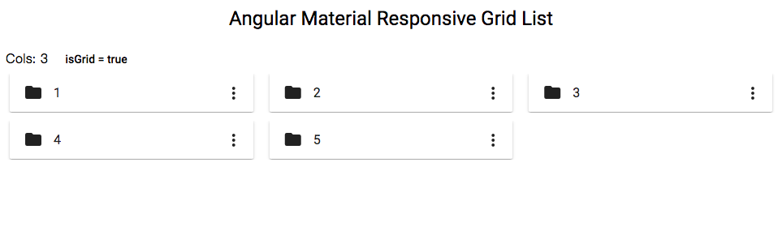

# ng-mat-responsive-grid-list

Angular Material grid list with responsive columns to show data in grid or list.



## Demo
[https://freemanlam.github.io/ng-mat-responsive-grid-list/](https://freemanlam.github.io/ng-mat-responsive-grid-list/)

## Dependencies
- Angular 11.2.4
- @angular/material 11.2.3

## Demo
```yarn start```

## Build and Use
This package is not in npm registry.

Run ```yarn add {relative-path}/ng-mat-responsive-grid-list/build/ng-mat-responsive-grid-list-0.0.5.tgz``` in your project.
